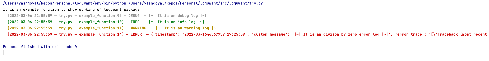

# loguwant
It's a Python package that enables you to log only what you want.

# uses
```commandline
export ROOT_LOG_LEVEL=DEBUG
export CURRENT_LOG_LEVEL=DEBUG
export LOG_DEPTH=current
```
```python
from loguwant import logger

logger = logger.get_logger()

def example_function():
    try:
        print('It is an example function to show working of loguwant package')
        logger.debug(logger.prepare_log('It is an debug log'))
        logger.info(logger.prepare_log('It is an info log'))
        logger.warning(logger.prepare_log('It is an warning log'))
    except Exception as err:
        logger.error(logger.prepare_exception_log('It is an error log'))
        
```
# output
